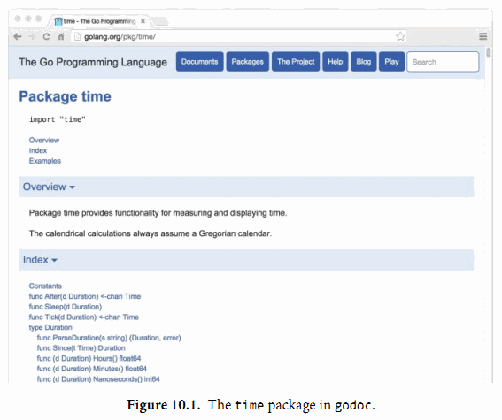

### 10.7.4. 包文檔

Go語言的編碼風格鼓勵為每個包提供良好的文檔。包中每個導出的成員和包聲明前都應該包含目的和用法說明的註釋。

Go語言中的文檔註釋一般是完整的句子，第一行通常是摘要說明，以被註釋者的名字開頭。註釋中函數的參數或其它的標識符並不需要額外的引號或其它標記註明。例如，下面是fmt.Fprintf的文檔註釋。

```Go
// Fprintf formats according to a format specifier and writes to w.
// It returns the number of bytes written and any write error encountered.
func Fprintf(w io.Writer, format string, a ...interface{}) (int, error)
```

Fprintf函數格式化的細節在fmt包文檔中描述。如果註釋後緊跟著包聲明語句，那註釋對應整個包的文檔。包文檔對應的註釋只能有一個（譯註：其實可以有多個，它們會組合成一個包文檔註釋），包註釋可以出現在任何一個源文件中。如果包的註釋內容比較長，一般會放到一個獨立的源文件中；fmt包註釋就有300行之多。這個專門用於保存包文檔的源文件通常叫doc.go。

好的文檔並不需要面面俱到，文檔本身應該是簡潔但不可忽略的。事實上，Go語言的風格更喜歡簡潔的文檔，並且文檔也是需要像代碼一樣維護的。對於一組聲明語句，可以用一個精煉的句子描述，如果是顯而易見的功能則並不需要註釋。

在本書中，只要空間允許，我們之前很多包聲明都包含了註釋文檔，但你可以從標準庫中發現很多更好的例子。有兩個工具可以幫到你。

首先是`go doc`命令，該命令打印其後所指定的實體的聲明與文檔註釋，該實體可能是一個包：

```
$ go doc time
package time // import "time"

Package time provides functionality for measuring and displaying time.

const Nanosecond Duration = 1 ...
func After(d Duration) <-chan Time
func Sleep(d Duration)
func Since(t Time) Duration
func Now() Time
type Duration int64
type Time struct { ... }
...many more...
```

或者是某個具體的包成員：

```
$ go doc time.Since
func Since(t Time) Duration

	Since returns the time elapsed since t.
	It is shorthand for time.Now().Sub(t).
```

或者是一個方法：

```
$ go doc time.Duration.Seconds
func (d Duration) Seconds() float64

	Seconds returns the duration as a floating-point number of seconds.
```

該命令並不需要輸入完整的包導入路徑或正確的大小寫。下面的命令將打印encoding/json包的`(*json.Decoder).Decode`方法的文檔：

```
$ go doc json.decode
func (dec *Decoder) Decode(v interface{}) error

	Decode reads the next JSON-encoded value from its input and stores
	it in the value pointed to by v.
```

第二個工具，名字也叫godoc，它提供可以相互交叉引用的HTML頁面，但是包含和`go doc`命令相同以及更多的信息。圖10.1演示了time包的文檔，11.6節將看到godoc演示可以交互的示例程序。godoc的在線服務 https://godoc.org ，包含了成千上萬的開源包的檢索工具。



你也可以在自己的工作區目錄運行godoc服務。運行下面的命令，然後在瀏覽器查看 http://localhost:8000/pkg 頁面：

```
$ godoc -http :8000
```

其中`-analysis=type`和`-analysis=pointer`命令行標誌參數用於打開文檔和代碼中關於靜態分析的結果。
